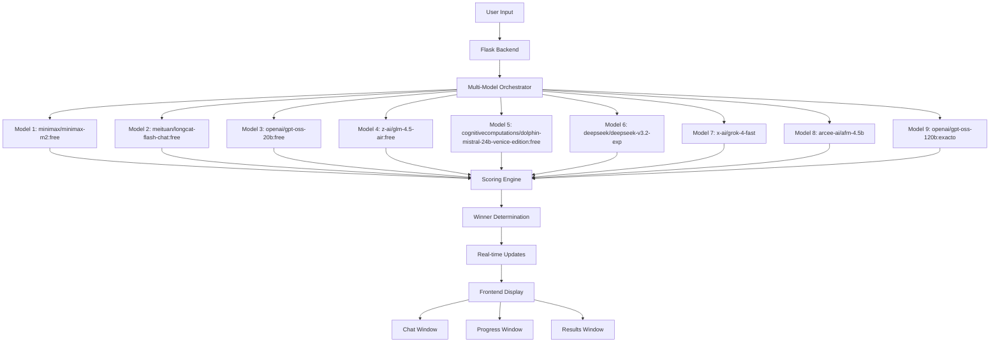

# AI Multi-Model Chatbot Architecture

## System Flow Diagram

## Components Overview

### Backend (Flask)
- **Multi-Model Orchestrator**: Manages parallel API calls to all 9 models
- **OpenRouter API Client**: Handles authentication and rate limiting
- **Scoring Engine**: Evaluates responses based on automated metrics
- **WebSocket/ SSE Handler**: Real-time progress updates

### Frontend (Vanilla JS)
- **Chat Interface**: User input and message display
- **Progress Tracker**: Live model status display
- **Results Viewer**: Show all responses and winner

### Scoring Metrics
- Response time (speed factor)
- Content quality (length, coherence)
- Relevance scoring
- Automated winner algorithm

## Technology Stack
- **Backend**: Flask + Python
- **Frontend**: HTML5, CSS3, Vanilla JavaScript
- **API**: OpenRouter API integration
- **Real-time**: WebSocket or Server-Sent Events
- **Styling**: Light theme, minimalistic design